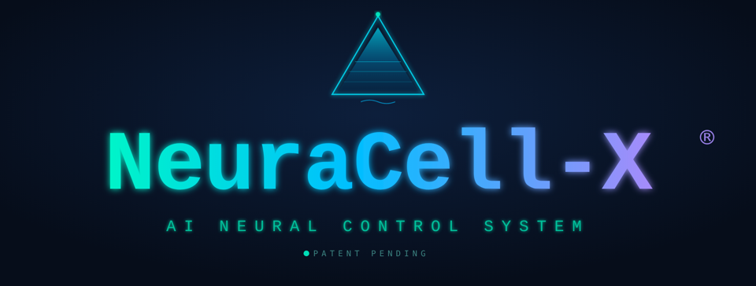

# Ambientika Add-ons for Home Assistant

<p align="center">
  
</p>

<p align="center">
  <a href="https://hacs.xyz"></a>
  
  
  
</p>

> **Official** Home Assistant Add-on repository for **Ambientika** ventilation units by [Südwind GmbH](https://www.ambientika.eu).

---

<p align="center">
  
</p>

<h3 align="center">Powered by NeuraCell-X&reg; &mdash; the patent-pending AI Neural Control System</h3>

<p align="center">
  <b>Active radon protection</b> &nbsp;&middot;&nbsp; <b>Intelligent dew-point ventilation</b> &nbsp;&middot;&nbsp; <b>Whole-home, fully automatic</b>
</p>

<p align="center">
  
  
  
  
</p>

> **When radon rises**, every unit shifts to a gentle fresh-air overpressure (Zuluft, Stufe 1) that slows radon ingress. **When the outside air is too humid to ventilate**, the units pause so no moisture is drawn in. **When conditions are safe again**, normal operation is restored &mdash; automatically, with radon protection always taking priority.

---

## Available Add-ons

### 🌀 Ambientika MQTT Bridge

Connects your Ambientika ventilation units to Home Assistant via MQTT with full Auto-Discovery support.

| Feature | Details |
|---|---|
| **Controls** | Operating mode, fan speed, humidity setpoint |
| **Sensors** | Humidity, temperatures, air quality, power consumption |
| **Binary Sensors** | Filter alarm, defrost active |
| **Discovery** | MQTT Auto-Discovery (devices appear automatically in HA) |
| **Devices** | Supports up to 20 units per installation |
| **NeuraCell-X®** | Patent-pending radon protection + dew-point control (see below) |

---

## NeuraCell-X&reg; &mdash; patent-pending radon & dew-point protection


**NeuraCell-X&reg;** is the AI Neural Control System built into the bridge. It couples the
Ambientika radon meter and dew-point control (Taupunktsteuerung) with your ventilation units:

- **Radon protection (highest priority):** radon alarm &rarr; all units to Intake (Zuluft / supply air) at fan **Stufe 1** &mdash; a gentle fresh-air overpressure that actively slows radon ingress.
- **Dew-point control:** ventilating would raise indoor humidity &rarr; units switch **off**; conditions favourable again &rarr; ventilation released.
- **Exact restore:** when all protections clear, every unit returns to the exact mode it had before.

The live status is published to `ambientika/neuracell/state` and surfaced natively on every platform:

| Platform | NeuraCell-X&reg; surface |
|---|---|
| **Home Assistant** | Auto-discovered *Radon Protection Active*, *Radon Level*, *Ventilation Blocked (Dew Point)*, *Dew Point Indoor / Outdoor* |
| **ioBroker** | `ambientika.0.neuracell.*` states |
| **Apple / Google / Alexa** (Homebridge) | *NeuraCell-X* accessory: Radon Protection + Dew-Point Block occupancy sensors |
| **Matter** (SmartThings, ...) | *NeuraCell-X Radon Protection* contact sensor |
| **Node-RED / Loxone** | `ambientika/neuracell/state` inputs (see the examples) |

Configure it in the add-on options / `config.yaml`: `radon_threshold`, `radon_protection_fan`,
`dewpoint_source` (`signal` or `computed`), `dewpoint_margin`, and more.

*NeuraCell-X&reg; and PhaseCell-X&reg; are registered trademarks of S&uuml;dwind / Ambientika. Patent pending.*

---

## Installation

1. In Home Assistant, go to **Settings → Add-ons → Add-on Store**
2. Click the three-dot menu (top right) → **Repositories**
3. Add this URL:
   ```
   https://github.com/ambientika-eu/ambientika-ha-addon
   ```
4. Search for **"Ambientika MQTT Bridge"** and click **Install**
5. Configure your Ambientika account credentials and MQTT broker settings
6. Start the add-on

### Prerequisites

- A running **MQTT broker** (e.g. the [Mosquitto add-on](https://github.com/home-assistant/addons/tree/master/mosquitto))
- An active **Ambientika cloud account** (from your Ambientika app)

---

## Configuration

### Prerequisites

- An **MQTT broker**. If you have none, install the official **Mosquitto broker**
  add-on first and start it.
- An **Ambientika account** — the same e-mail address and password you use in the
  Ambientika app. There is no separate account for the bridge.

| Option | Default | Description |
|---|---|---|
| `ambientika_username` | – | E-mail address of your Ambientika app account |
| `ambientika_password` | – | Password of your Ambientika app account |
| `mqtt_host` | `core-mosquitto` | MQTT broker hostname |
| `mqtt_port` | `1883` | MQTT broker port |
| `mqtt_username` | – | Broker user — **required** for the Mosquitto add-on, which refuses anonymous connections |
| `mqtt_password` | – | Broker password |
| `mqtt_topic_prefix` | `ambientika` | MQTT topic prefix |
| `poll_interval` | `30` | Polling interval in seconds (10–300) |
| `availability_failure_threshold` | `3` | Consecutive failed reads before a unit is shown unavailable |
| `log_level` | `INFO` | Log level (DEBUG, INFO, WARNING, ERROR) |
| `command_coalesce_ms` | `800` | Commands for the same unit within this window are applied in one call (`0` = immediately) |
| `slave_filter_soft_reset` | `false` | Maintenance acknowledgement for Slave filter counters |
| `filter_ack_ttl_days` | `90` | How long an acknowledgement stays valid |

Leaving `mqtt_username` and `mqtt_password` empty is the most common setup
mistake: the log then shows `MQTT connection failed (rc=5)`.

The full user documentation is in
[`ambientika_mqtt_bridge/DOCS.md`](ambientika_mqtt_bridge/DOCS.md); Home Assistant
shows it in the add-on's **Documentation** tab.

---

## Support

- 🐛 **Issues & Bug Reports:** [GitHub Issues](https://github.com/ambientika-eu/ambientika-ha-addon/issues)
- 🌐 **Website:** [www.ambientika.eu](https://www.ambientika.eu)
- 📧 **E-Mail:** [info@ambientika.eu](mailto:info@ambientika.eu)

---

## About

This add-on is developed and maintained by **Südwind GmbH**, the manufacturer of Ambientika ventilation systems.

© Südwind GmbH – [www.ambientika.eu](https://www.ambientika.eu)

---

## Humidity and dew-point control

The folder feuchteregelung holds a ready-made Home Assistant package for humidity- and dew-point-based ventilation control. It is generated from a short configuration file, so ten units can be covered without copy-paste errors, and it builds on the entities this add-on creates.

The point that matters: ventilation only dries a room when the outdoor air holds less water in absolute terms. Relative humidity is the wrong measure for that decision — outside at 28 °C and 60 % there are 16.3 g of water per m³, inside at 22 °C and 60 % only 11.6. The package therefore works with absolute humidity and dew point throughout, and applies a per-unit sensor offset taken from your own comparison measurement.

Installation, the calibration procedure and the reasoning behind it are described in feuchteregelung/README.md. 56 tests, no hardware required.
